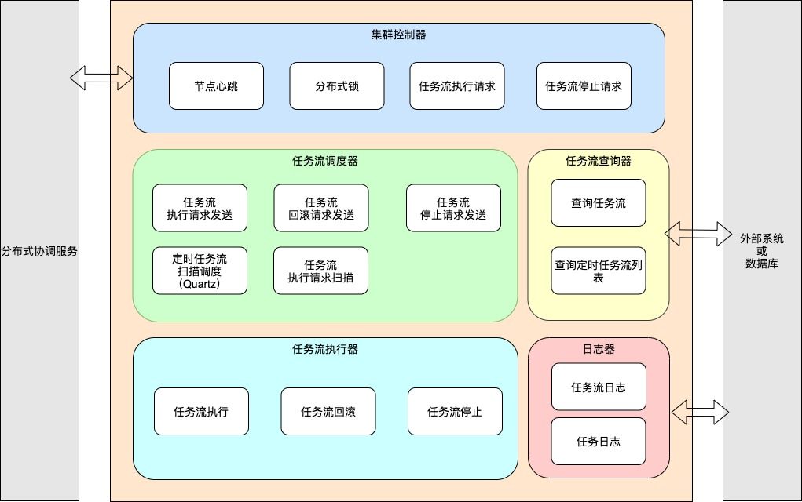

# wolFFlow

## 简介

wolf-flow 是一个简单的、支持有向无环图（DAG）的轻量级作业调度框架。

## 功能特点

简单：简单到除了任务调度，几乎没有其他功能。

易集成：基于 Spring Boot 自动配置，提供 spring-boot-starter 快速集成。

易扩展：各组件均可自定义实现，可根据接口和任务流生命周期，通过覆写自定义实现，或注入一些特殊处理的代码。

支持有向无环图（DAG)：一个任务流就是一个有向无环图，默认提供算法支持有序且尽可能并行地执行任务流中的任务。

支持分段执行：支持指定从任务流中的某个任务开始执行，也支持指定执行到任务流中的某个任务结束。

支持定时任务：集成了 Quartz 框架实现基于 cron 表达式的定时任务调度。

支持集群：默认只支持单机，可以通过自定义实现集群控制器接口，如借助 Redis 或 ZooKeeper 实现分布式锁和分布式队列等来支持集群。

支持任务状态监控：支持实时监控任务流以及任务的状态，默认是存储在内存中，可以通过自定义实现日志器接口，将数据持久化到数据库。同时任务流和任务的状态变化时会发布事件，可以通过监听器订阅相应的事件来进行监控。

支持任务实时日志：支持实时查询任务滚动日志，默认是存储在内存中，可以通过自定义实现日志器接口，将数据持久化到数据库。

## 快速入门

### 1. 添加 Maven 依赖

``` xml
<dependency>
    <groupId>me.kpali</groupId>
    <artifactId>wolf-flow-spring-boot-starter</artifactId>
    <version>1.0.0</version>
</dependency>
```

### 2. 在 resources 目录下新建 quartz.properties 配置文件

```
org.quartz.scheduler.instanceName = MyScheduler
org.quartz.threadPool.threadCount = 3
org.quartz.jobStore.class = org.quartz.simpl.RAMJobStore
```

### 3. 启动任务流调度器

``` java
/**
 * 程序启动完成事件监听，在程序启动后启动任务流调度器
 * （必要）
 */
@Component
public class ApplicationReadyEventListener implements ApplicationListener<ApplicationReadyEvent> {
    @Autowired
    ITaskFlowScheduler taskFlowScheduler;

    @Override
    public void onApplicationEvent(ApplicationReadyEvent applicationReadyEvent) {
        taskFlowScheduler.startup();
    }
}
```

### 4. 实现任务流查询器接口，读取并构建任务流数据

``` java
/**
 * 自定义任务流查询器，覆写父类的方法，实现自定义任务流查询器
 * （必要）
 */
@Primary
@Component
public class MyTaskFlowQuerier extends DefaultTaskFlowQuerier {
    @Override
    public TaskFlow getTaskFlow(Long taskFlowId) throws TaskFlowQueryException {
        // TODO 根据ID查询任务流
    }

    @Override
    public List<TaskFlow> listCronTaskFlow() throws TaskFlowQueryException {
        // TODO 查询定时任务流
    }
}
```

### 5. 实现任务的执行和停止接口

```java
/**
 * 自定义任务，覆写父类的方法，实现自定义任务的执行内容
 * （必要）
 */
public class MyTask extends Task {
    @Override
    public void execute(TaskFlowContext taskFlowContext) throws TaskExecuteException, TaskInterruptedException {
        // TODO 执行任务
    }

    @Override
    public void stop(TaskFlowContext taskFlowContext) throws TaskStopException {
        // TODO 停止任务
    }
}
```

### 6. 触发执行任务流

``` java
@Autowired
ITaskFlowScheduler taskFlowScheduler;

public void test() {
    long taskFlowId = 1;
    Map<String, Object> params = null;
    long taskFlowLogId = taskFlowScheduler.trigger(taskFlowId, params);
}
```

具体请参考示例程序：`wolf-flow-sample` 和 `wolf-flow-sample-cluster`。

## 架构设计

### 架构图



1. 任务流查询器：提供任务流的查询，包括定时任务流列表的查询。

2. 任务流调度器：提供任务流的触发、停止，以及定时任务流的调度，触发和停止操作均是向集群控制器发起一条请求。另外，为避免重复触发，集群中各节点会竞争成为 `master` 节点，定时任务流的只能由 `master` 节点进行调度和触发。

3. 集群控制器：提供分布式锁，分布式队列、集合等操作，用于协调集群各节点有序、安全地执行操作。

4. 任务流执行器：接收任务流执行请求，并通过算法依序执行任务流（有向无环图）中的任务。
5. 日志器：提供任务流和任务的日志记录和查询，包括状态的记录和查询。

### 任务流生命周期


