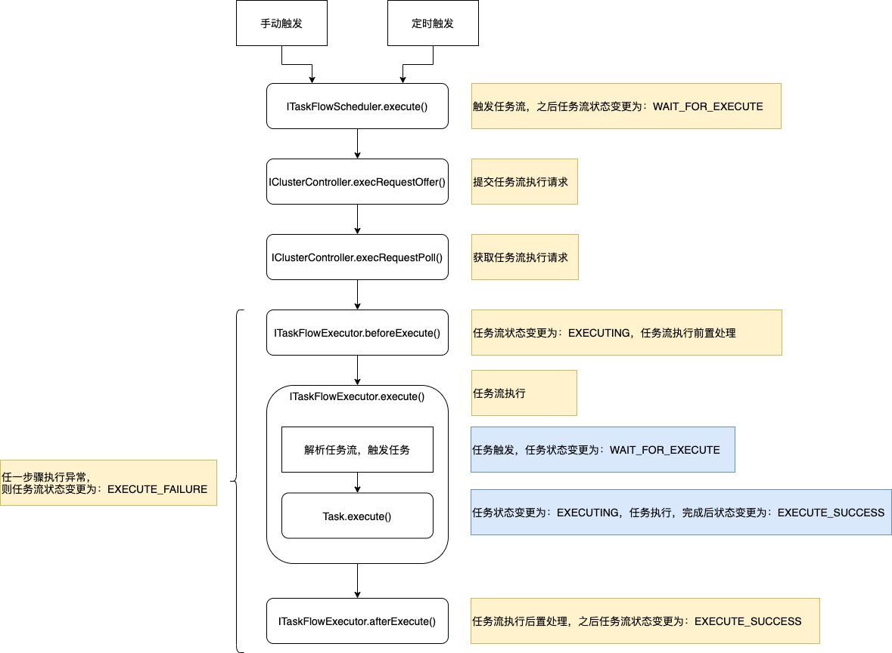
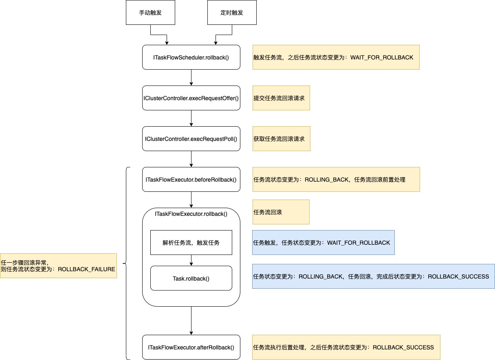

# wolFFlow

## 简介

wolf-flow 是一个简单的、支持有向无环图（DAG）的轻量级作业调度引擎。

## 功能特点

简单：简单到除了任务调度，几乎没有其他功能。

易集成：基于 Spring Boot 自动配置，提供 spring-boot-starter 快速集成。

易扩展：各组件均可自定义实现，可根据接口和任务流生命周期，通过覆写自定义实现，或注入一些特殊处理的代码。

支持有向无环图（DAG)：一个任务流就是一个有向无环图，默认提供算法支持有序且尽可能并行地执行任务流中的任务。

支持分段执行：支持指定从任务流中的某个任务开始执行，也支持指定执行到任务流中的某个任务结束。

支持定时任务：集成了 Quartz 框架实现基于 cron 表达式的定时任务调度。

支持集群：默认只支持单机，可以通过自定义实现集群控制器接口，如借助 Redis 或 ZooKeeper 实现分布式锁和分布式队列等来支持集群。

支持任务状态监控：支持实时监控任务流以及任务的状态，默认是存储在内存中，可以通过自定义实现日志器接口，将数据持久化到数据库。同时任务流和任务的状态变化时会发布事件，可以通过监听器订阅相应的事件来进行监控。

支持任务实时日志：支持实时查询任务滚动日志，默认是存储在内存中，可以通过自定义实现日志器接口，将数据持久化到数据库。

## 快速入门

### 1. 添加 Maven 依赖

``` xml
<dependency>
    <groupId>me.kpali</groupId>
    <artifactId>wolf-flow-spring-boot-starter</artifactId>
    <version>2.0.0</version>
</dependency>
```

### 2. 在 resources 目录下新建 quartz.properties 配置文件

```
org.quartz.scheduler.instanceName = MyScheduler
org.quartz.threadPool.threadCount = 3
org.quartz.jobStore.class = org.quartz.simpl.RAMJobStore
```

### 3. 启动任务流相关的后台线程

``` java
/**
 * 程序启动完成事件监听，在程序启动后启动任务流相关的后台线程
 * （必要）
 */
@Component
public class ApplicationReadyEventListener implements ApplicationListener<ApplicationReadyEvent> {
    @Autowired
    private Launcher launcher;

    @Override
    public void onApplicationEvent(ApplicationReadyEvent applicationReadyEvent) {
        this.launcher.startup();
    }
}
```

### 4. 实现任务流查询器接口，读取并构建任务流数据

``` java
/**
 * 自定义任务流查询器，覆写父类的方法，实现自定义任务流查询器
 * （必要）
 */
@Primary
@Component
public class MyTaskFlowQuerier extends DefaultTaskFlowQuerier {
    @Override
    public TaskFlow getTaskFlow(Long taskFlowId) throws TaskFlowQueryException {
        // TODO 根据ID查询任务流
    }

    @Override
    public List<TaskFlow> listCronTaskFlow() throws TaskFlowQueryException {
        // TODO 查询定时任务流
    }
}
```

### 5. 实现任务的执行和停止接口

```java
/**
 * 自定义任务，覆写父类的方法，实现自定义任务的执行内容
 * （必要）
 */
public class MyTask extends Task {
    @Override
    public void execute(Map<String, Object> context) throws TaskExecuteException, TaskInterruptedException {
        // TODO 执行任务
    }
    
    @Override
    public void rollback(Map<String, Object> context) throws TaskRollbackException, TaskInterruptedException {
        // TODO 回滚任务
    }
    
    @Override
    public void stop(Map<String, Object> context) throws TaskStopException {
        // TODO 停止任务
    }
}
```

### 6. 触发执行任务流

``` java
@Autowired
ITaskFlowScheduler taskFlowScheduler;

public void test() {
    long taskFlowId = 1;
    Map<String, Object> params = null;
    long taskFlowLogId = taskFlowScheduler.execute(taskFlowId, params);
}
```

### 7. 更多用法

请参考示例程序：`wolf-flow-sample` 和 `wolf-flow-sample-cluster`

## 基本概念

### 任务（Task）

任务是最小的工作单元，是实现作业步骤的实体。

任务定义了若干个接口，例如执行任务、回滚任务、停止任务等，根据不同业务场景可以有不同的实现。

### 连接（Link）

连接用于表示不同任务之间的顺序关系，连接是有向的，表示在某个任务执行完成后执行另一个任务。

### 任务流（Task Flow）

任务流是多个任务和多个连接的组合，通过编排任务和任务之间的连接，形成实现某个具体事务的任务流。

任务流可以立即/定时执行，停止和回滚。

### 上下文（Context）

上下文是执行期间任务流内共享的环境变量，任务中可以直接访问和修改上下文。上下文主要分为任务流上下文和任务上下文，结构大致如下：

``` json
{
    "taskFlowId" : 100,
    "logId" : 10000,
    "..." : "...",
    "taskContexts" : {
        "1" : {
            "logId" : 10001,
            "parentTaskIdList" : [
            ],
            "..." : "..."
        },
        "2" : {
            "logId" : 10002,
            "parentTaskIdList" : [
                1
            ],
            "..." : "..."
        }
    }
}
```

### 任务流日志（Task Flow Log）

任务流日志是任务流的执行记录，包含某次执行的任务流状态、上下文和执行时间等数据，一次任务流执行产生一条任务流日志。

### 任务日志（Task Log）

任务日志是任务的执行记录，包含某次执行的任务状态、上下文和执行时间等数据，一次任务执行产生一条任务日志。

## 架构设计

### 架构图


1. 任务流查询器：提供任务流的查询，包括定时任务流列表的查询。
2. 任务流调度器：提供任务流的触发、停止，以及定时任务流的调度，触发和停止操作均是向集群控制器发起一条请求。另外，为避免重复触发，集群中各节点会竞争成为 `master` 节点，定时任务流的只能由 `master` 节点进行调度和触发。
3. 集群控制器：提供节点心跳发送、分布式锁，分布式队列、集合等操作，用于协调集群各节点有序、安全地执行操作。
4. 任务流执行器：接收任务流执行请求，并通过算法依序执行任务流（有向无环图）中的任务。
5. 日志器：提供任务流和任务的日志记录和查询，包括状态的记录和查询。

### 集群模式


### 任务流执行


执行任务流时，根据任务流编排的方向有序执行。

每个任务依次执行 `beforeExecute() ` ， `execute() ` 和 `afterExecute() ` 接口。

当任务1执行完成后，任务2和任务3会并行执行，任务4则会等待任务2执行完成后再开始执行。

最大并行任务数取决于任务流执行器的线程池最大线程数。

**任务流执行生命周期：**



### 任务流回滚


任务流回滚的时候，则是反向顺序执行。

每个任务依次执行 `beforeRollback() ` ， `rollback() ` 和 `afterRollback() ` 接口。

由于任务3和任务4没有依赖任务，所以最先开始回滚。任务1则会等待任务2和任务3都回滚成功才会开始回滚。

同样，最大并行任务数取决于任务流执行器的线程池最大线程数。

**任务流回滚生命周期：**



### 事件发布与监听

引擎运行期间，特定事件发生时会发布事件通知，目前主要有以下事件：

- 任务流定时调度状态变更事件：当一条任务流加入或更新定时调度，以及定时调度失败时发生。
- 任务流状态变更事件：当任务流变更为”等待执行“、”执行中“、”执行成功“等状态时发生。
- 任务状态变更事件：当任务变更为”等待执行“、”执行中“、”执行成功“等状态时发生。

事件的发布与订阅使用的是 Spring 的事件机制，需要订阅时定义一个事件监听器，参考如下：

``` java
    @EventListener
    public void taskFlowStatusChange(TaskFlowStatusChangeEvent event) {
        Long taskFlowId = event.getTaskFlowStatus().getTaskFlow().getId();
        String status = event.getTaskFlowStatus().getStatus();
        System.out.println(">>>>>>>>> 任务流[" + taskFlowId + "]状态变更为：" + status);
    }
```

